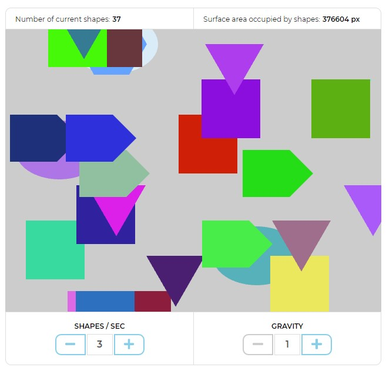
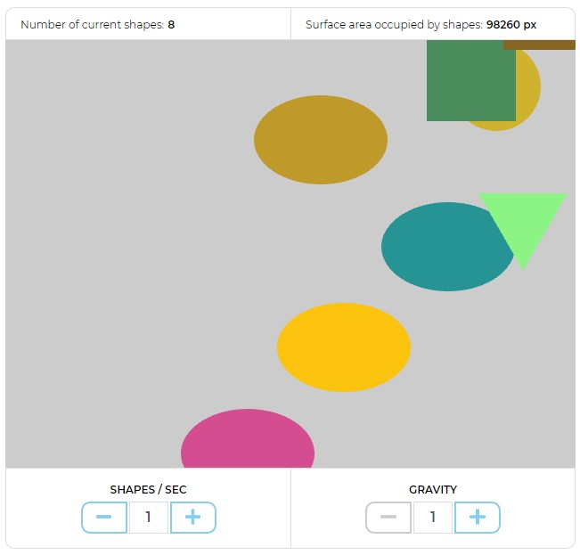
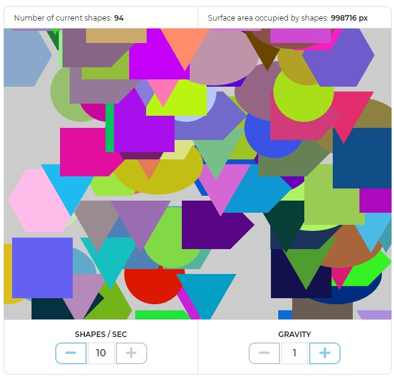

# Shape generator

Shape generator generates shapes in a random order and a random color. 6 types of shapes are available: 3 sides, 4 sides, 5 sides, 6 sides, circle, ellipse. By increasing/decreasing "shapes/sec" controller number of generated shapes per second can be controlled. By increasing/decreasing "gravity" controller falling speed of the shapes can be controlled. By clicking the selected shape it disappeares and all the shapes of the same type change their color. By clicking empty scene area, randomly generated shape with a random color appeares at mouse position. Information panel above the scene container shows number of shapes currently visible as well as the total area they occupy.

## Getting started

- Clone the repository
```
git clone https://github.com/boobzzz/shape-generator.git
``` 
- Install dependencies
```
yarn install
```
- Build the project
```
yarn esbuild
yarn esbuild-min
yarn watch
```
You can generate a full clean build with `yarn build-all` (which uses both `tsc` and `esbuild`).

## Libraries and dependencies used

- [PixiJS](https://pixijs.com/)
- [esbuild](https://esbuild.github.io/)